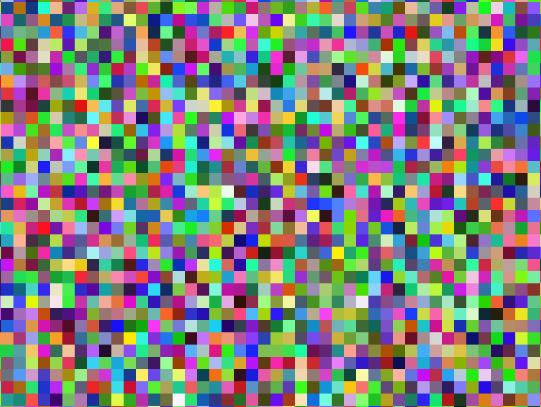

# Thomas Hikaru Clark's Page

## About Me
My family is half-Japanese and half-American, and my three sisters and I grew up in Tokyo, Japan. Since then, my family has moved around a lot (London, Washington D.C., Manila). After graduating from college, I spent two years [teaching](https://ace.nd.edu/news/getting-things-done-escape-room-style) HS Computer Science and Math in Jacksonville, FL. What I loved about being a teacher was the opportunity to make complex ideas accessible to students, as well as engaging in coaching and mentorship. I am currently living and studying as a PhD student at MIT in Cambridge, Massachusetts. 

## Interests
I am broadly interested in machine learning for NLP, linguistics, data science, etc. I have worked on projects involving from a variety of sub-areas, including speech recognition, information-theoretic approaches to language processing, and stance detection on news and social media datasets. I am excited about computational models of human cognition, and the intersection between NLP and cognitive science. In my opinion, the biggest challenge for NLP systems is resolving ambiguity in a human-like way, and I am interested in research that examines how language models handle syntactic and semantic ambiguity. I am currently working on a project that involves applying Transformer-based language models (BERT, RoBERTa) to stance detection for social media with commonsense and factual knowledge infusion from Knowledge Graphs. 

My other interests include urban design, maps, AI ethics, language learning, and philosophy. 

## Education
I am currently a PhD candidate at MIT in the department of Brain and Cognitive Sciences. I received my undergraduate degree in Computer Science from Princeton University, where I also earned certificates in Linguistics and Russian Language & Culture. After graduating from Princeton, I earned a M.Ed. from the University of Notre Dame as part of the ACE Teaching Fellows 25th Cohort. After finishing 2 years of teaching, I completed an MPhil in Theoretical and Applied Linguistics from the University of Cambridge, where I was involved in the [Language Technology Lab](http://ltl.mml.cam.ac.uk/). 

## Experience
Most recently, I worked as a Machine Learning Research Intern at Vimeo. Previously, I interned on the IBM Watson Speech to Text team, working on machine learning approaches for speech recognition and dataset verification. Previously, I have done iOS development for the Paideia Institute in Rome, Italy, and have done volunteer service projects in Russia and Japan. During the summer of 2021, I was an instructor for a summer startup camp at the Cambridge Center for International Research, teaching machine learning and data science principles to students from around the world. 

## Check out my Podcast
I host a podcast called Modus Mirandi, which is dedicated to meaningful conversations on random topics with people from different backgrounds and disciplines. You can check it out on [Spotify](https://open.spotify.com/show/1NeIw3Y3aG6HaZ1U0eB8zq) or other podcast platforms. 

## Follow Me on Medium
Please follow me at https://medium.com/@thomashikaru to see my latest writings on data science, computational linguistics, cities, maps, education, and more! 

[New to Data Visualization? Start With New York City](https://towardsdatascience.com/new-to-data-visualization-start-with-new-york-city-107785f836ab)

[Why Neural Nets Can Approximate Any Function](https://towardsdatascience.com/why-neural-nets-can-approximate-any-function-a878768502f0)

[Analyzing YouTube Discourse with NLP](https://towardsdatascience.com/analyze-youtube-discourse-and-find-troll-bots-with-python-410daacbba6b)

[A Meditation on the Mandelbrot Set](https://medium.com/swlh/a-meditation-on-the-mandelbrot-set-45fcb52ab673)

[An Intuitive Look at the Basics of Information Theory](https://towardsdatascience.com/an-intuitive-look-at-the-basics-of-information-theory-2bf0d2fff85e)

