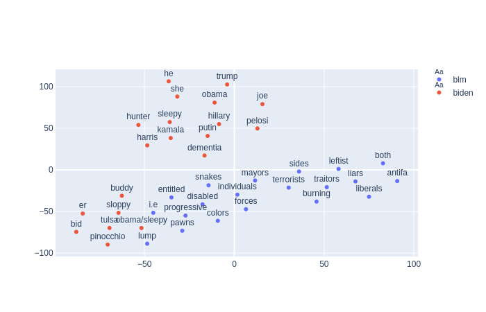

# Thomas Hikaru Clark's Page

## About Me
I grew up in Tokyo, Japan but my family has moved around a lot since then. After graduating from college, I spent two years teaching HS Computer Science and Math in Jacksonville, FL. What I loved about being a teacher was the opportunity to make complex ideas accessible to students, as well as engaging in coaching and mentorship. I have three sisters, a mixed-breed rescue dog, and Bi-Racial Identity Confusion Syndrome (BRICS). 

## Interests
I am broadly interested in machine learning for NLP, linguistics, data science, etc. More specifically within NLP, I am interested in sequence-to-sequence models and context-sensitive word embeddings. I am excited about the computational models of human cognition, and the intersection between NLP and cognitive science. 

My other interests include urban design, maps, AI ethics, language learning, and philosophy. 

## Education
I received my undergraduate degree in Computer Science from Princeton University, where I also earned certificates in Linguistics and Russian Language & Culture. 
I earned a M.Ed. from the University of Notre Dame as part of the ACE Teaching Fellows 25th Cohort. I am currently pursuing an MPhil in Theoretical and Applied Linguistics from the University of Cambridge, where I am involved in the Language Technology Lab. 

## Experience
Most recently, I interned on the IBM Watson Speech to Text team, working on machine learning approaches for speech recognition and dataset verification. Previously, I have done iOS development for the Paideia Institute in Rome, Italy, and have done volunteer service projects in Russia and Japan. 

## Follow Me on Medium
Please follow me at https://medium.com/@thomashikaru to see my latest writings on data science, computational linguistics, cities, maps, education, and more! 

[New to Data Visualization? Start With New York City](https://towardsdatascience.com/new-to-data-visualization-start-with-new-york-city-107785f836ab)

[Why Neural Nets Can Approximate Any Function](https://towardsdatascience.com/why-neural-nets-can-approximate-any-function-a878768502f0)

[Analyzing YouTube Discourse with NLP](https://towardsdatascience.com/analyze-youtube-discourse-and-find-troll-bots-with-python-410daacbba6b)

[A Meditation on the Mandelbrot Set](https://medium.com/swlh/a-meditation-on-the-mandelbrot-set-45fcb52ab673)

