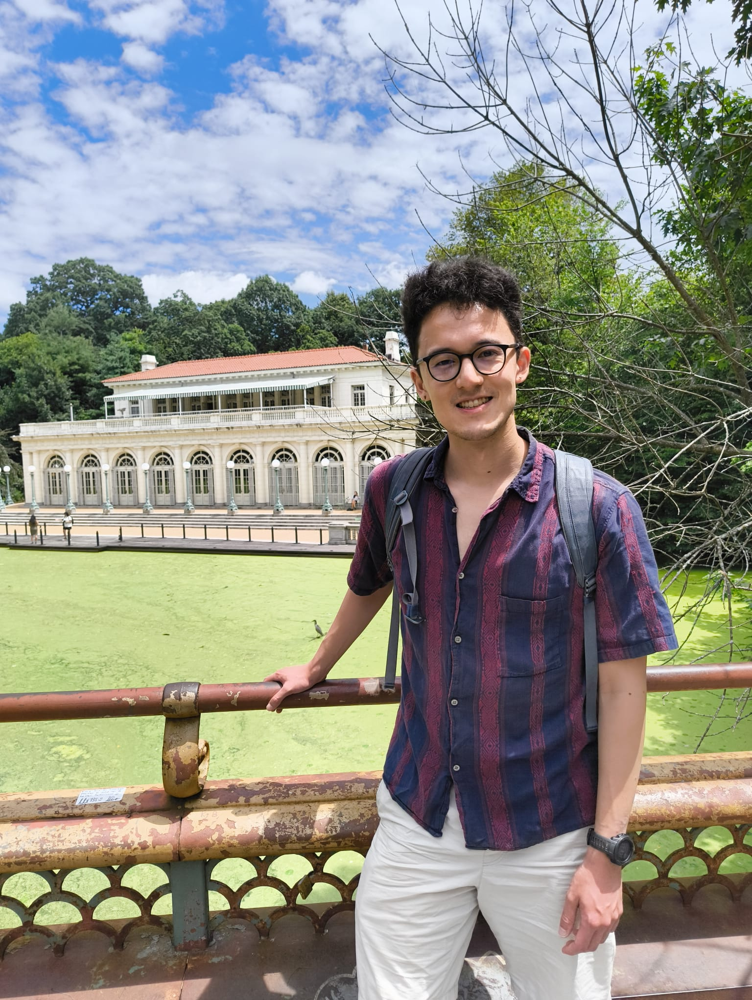

# Thomas Hikaru Clark

Hi! I'm Thomas :)

## Interests
I am interested in the principles underlying human language and cognition, and how the tools of NLP, information theory, and probabilistic inference can shed light on these principles. My primary line of research involves building algorithmic models of "noisy-channel language processing", explaining how humans are able to extract meaning from anomalous or erroneous utterances in a cognitively plausible and resource-rational way. 

I've also done projects investigating what factors influence how speakers choose between two possible ways of saying the same thing, looking at the Russian comparative alternation as a case study via both corpus study and behavioral experimentation; what makes some sentences more memorable than others, what might explain why languages have the word orders that they do; and what speakers modulate how they talk to emphasize surprising words in conversation.  

My other interests include urban design, AI ethics, language learning, and science communication. 

## Curriculum Vitae

[Thomas Hikaru Clark CV](pubs/Thomas%20Hikaru%20Clark%20-%20Curriculum%20Vitae-November-2025.pdf)

## Publications and Presentations

### Publications

- **Clark, T. H.,** Tuckute, G., Medina, B., & Fedorenko, E. (2026). [A distinctive meaning makes a sentence memorable.](https://doi.org/10.1016/j.jml.2025.104700) Journal of Memory and Language, 146, 104700. <a href="pubs/Sentence_Memorability_JML_202509.pdf" class="pdf-link" title="Download PDF"><i class="fas fa-file-pdf"></i></a>
- **Clark, T. H.,** Vigly, J. H., Gibson, E., & Levy, R. P. (2025). [Resource-Rational Noisy-Channel Language Processing: Testing the Effect of Algorithmic Constraints on Inferences.](https://aclanthology.org/2025.emnlp-main.1207/) In C. Christodoulopoulos, T. Chakraborty, C. Rose, & V. Peng (Eds.), Proceedings of the 2025 Conference on Empirical Methods in Natural Language Processing (pp. 23659–23672). Association for Computational Linguistics. <a href="https://aclanthology.org/2025.emnlp-main.1207.pdf" class="pdf-link" title="Download PDF"><i class="fas fa-file-pdf"></i></a>
- **Clark, T.,** Vigly, J. H., Gibson, E., & Levy, R. (2025). [A Model of Approximate and Incremental Noisy-Channel Language Processing.](https://escholarship.org/uc/item/9kr1b1gm) Proceedings of the Annual Meeting of the Cognitive Science Society, 47(0). <a href="https://escholarship.org/uc/item/9kr1b1gm" class="pdf-link" title="Download PDF"><i class="fas fa-file-pdf"></i></a>
- **Clark, T. H.,** Poliak, M., Regev, T., Haskins, A. J., Gibson, E., & Robertson, C. (2025). [The relationship between surprisal, prosody, and backchannels in conversation reflects intelligibility-oriented pressures.](https://onlinelibrary.wiley.com/doi/10.1111/cogs.70134) Cognitive Science. <a href="https://onlinelibrary.wiley.com/doi/epdf/10.1111/cogs.70134" class="pdf-link" title="Download PDF"><i class="fas fa-file-pdf"></i></a>
- Ivanova, A. A., Sathe, A., Lipkin, B., Kumar, U., Radkani, S., **Clark, T. H.,** Kauf, C., Hu, J., Pramod, R. T., Grand, G., Paulun, V., Ryskina, M., Akyürek, E., Wilcox, E., Rashid, N., Choshen, L., Levy, R., Fedorenko, E., Tenenbaum, J., & Andreas, J. (2024). [Elements of World Knowledge (EWOK): A cognition-inspired framework for evaluating basic world knowledge in language models.](https://doi.org/10.1162/TACL.a.38) Transactions of the Association for Computational Linguistics.
- **Clark, T. H.,** Meister, C., Pimentel, T., Hahn, M., Cotterell, R., Futrell, R., & Levy, R. (2023). [A Cross-Linguistic Pressure for Uniform Information Density in Word Order.](https://doi.org/10.1162/tacl_a_00589) Transactions of the Association for Computational Linguistics.
- **Clark, T.,** Wilcox, E. G., Gibson, E., & Levy, R. (2022). [Evidence for Availability Effects on Speaker Choice in the Russian Comparative Alternation.](https://escholarship.org/uc/item/1q19f8vt) Proceedings of the Annual Meeting of the Cognitive Science Society. <a href="https://escholarship.org/uc/item/1q19f8vt" class="pdf-link" title="Download PDF"><i class="fas fa-file-pdf"></i></a>
- Meister, C., Pimentel, T., **Clark, T. H.,** Cotterell, R., & Levy, R. (2022). [Analyzing Wrap-Up Effects through an Information-Theoretic Lens.](https://aclanthology.org/2022.acl-short.3.pdf) Proceedings of the 60th Annual Meeting of the Association for Computational Linguistics. <a href="https://aclanthology.org/2022.acl-short.3.pdf" class="pdf-link" title="Download PDF"><i class="fas fa-file-pdf"></i></a>
- **Clark, T.,** Conforti, C., Liu, F., Meng, Z., Shareghi, E., & Collier, N. (2021). [Integrating Transformers and Knowledge Graphs for Twitter Stance Detection.](https://aclanthology.org/2021.wnut-1.34/) Proceedings of the Seventh Workshop on Noisy User-Generated Text (W-NUT 2021).
- Katsos, N., Banerjee, E., Chang, Y. J., **Clark, T.,** Cowan, J., Williamson, T. R., & Witkowska, Z. (2021). [Experimental Pragmatics: The Making of a Cognitive Science.](https://doi.org/10.1016/j.pragma.2021.09.006.) Journal of Pragmatics.
- Meng, Z., Liu, F., **Clark, T. H.,** Shareghi, E., & Collier, N. (2021). [Mixture-of-partitions: Infusing large biomedical knowledge graphs into BERT.](https://aclanthology.org/2021.emnlp-main.383.pdf) Proceedings of the 2021 Conference on Empirical Methods in Natural Language Processing. <a href="https://aclanthology.org/2021.emnlp-main.383.pdf" class="pdf-link" title="Download PDF"><i class="fas fa-file-pdf"></i></a> 

### Oral Presentations

- “Resource-Rational Noisy-Channel Language Processing: Testing the Effect of Algorithmic Constraints on Inferences”, 2025 Conference on Empirical Methods in Natural Language Processing.
- “A Model of Approximate and Incremental Noisy-Channel Language Processing”, 47th Annual Meeting of the Cognitive Science Society.
- “Evidence for an Availability-Based Production Account of the Russian Comparative Alternation via Corpus Analysis”, 35th Annual Conference on Human Sentence Processing.

### Poster Presentations

- "A Model of Approximate and Incremental Noisy-Channel Language Processing", 47th Annual Meeting of the Cognitive Science Society (upcoming).
- "[Modeling Noisy-Channel Language Processing with Incremental and Approximate Probabilistic Inference](pubs/HSP2025Poster_NoisyChannelModel.pdf)", 38th Annual Conference on Human Sentence Processing. 
- "[Meaning distinctiveness predicts sentence memorability](pubs/HSP2025Poster_SentenceMemorability.pdf)", 38th Annual Conference on Human Sentence Processing.
- "Inferring Errors and Intended Meanings with a Generative Model of Language Production in Aphasia", 46th Annual Meeting of the Cognitive Science Society.
- "A Cross-Linguistic Pressure for Uniform Information Density in Word Order", EMNLP 2023. 
- "Context-sensitive features predict sentence memorability in the absence of memorable words", 45th Annual Meeting of the Cognitive Science Society. 
- "Word Frequency Predicts Word Errors in Stroke-Induced Aphasia", 36th Annual Conference on Human Sentence Processing.
- "Evidence for Syntax-Lexicon Trade-off in Stroke-Induced Aphasia Patients", 36th Annual Conference on Human Sentence Processing.
- "A Cross-Linguistic Pressure for Uniform Information Density in Word Order", 36th Annual Conference on Human Sentence Processing.
- "Evidence for Availability Effects on Speaker Choice in the Russian Comparative Alternation", 44th Annual Meeting of the Cognitive Science Society.

## Education
I am currently a PhD candidate at MIT in the department of Brain and Cognitive Sciences, where I am a member of [TedLab](http://tedlab.mit.edu/) and the [Computational Psycholinguistics Lab](http://cpl.mit.edu/). I received my undergraduate degree in Computer Science from Princeton University, where I also earned certificates in Linguistics and Russian Language & Culture. After college, I earned an M.Ed. from the University of Notre Dame as part of the ACE Teaching Fellows 25th Cohort; I [taught](https://ace.nd.edu/news/getting-things-done-escape-room-style) HS Computer Science and Math in Jacksonville, FL. Afterwards, I returned to grad school for an MPhil in Theoretical and Applied Linguistics from the University of Cambridge, where I was involved in the [Language Technology Lab](http://ltl.mml.cam.ac.uk/) and continued on to a PhD in a different city named Cambridge. 

## Other Experience
Before starting my PhD, I interned at Vimeo on the Machine Learning Research team and at IBM Watson on the Speech to Text team. Previously, I have done iOS development for the Paideia Institute in Rome, Italy, and have done volunteer service projects in Russia and Japan. During the summer of 2021, I was an instructor for a summer startup camp at the Cambridge Center for International Research, teaching machine learning and data science principles to students from around the world. 

